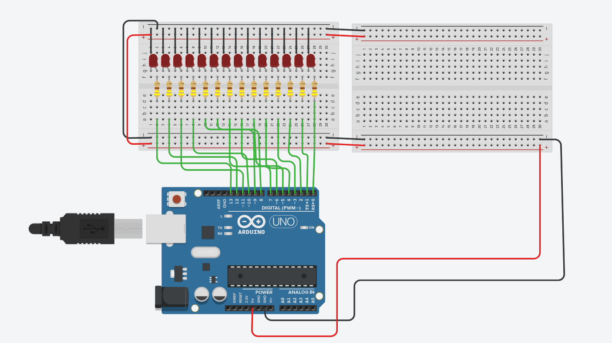

# Projeto: Pisca-LEDs com Temporizações Escalonadas

Este projeto implementa um sistema de temporizações escalonadas utilizando a função `millis()` do Arduino. O código acende e apaga LEDs conectados aos pinos digitais de 0 a 13 com diferentes frequências, simulando tarefas periódicas com intervalos distintos de tempo.

## Objetivo
Simular um RTOS , escalonando a ativação dos leds de acordo com passar do tempo

## Imagem do circuito

## Funcionamento

- O sistema baseia-se em um temporizador de **5 milissegundos**.
- A cada 5 ms, uma função principal (`Coisas_5_mili()`) é chamada, que gerencia o escalonamento de outras tarefas baseadas em múltiplos de tempo (100ms, 500ms, etc).
- Cada função ligada a um tempo específico inverte o estado de dois pinos digitais, fazendo os LEDs piscarem em diferentes velocidades.
- Os pinos 0 e 1 alternam a cada ciclo do `loop()` principal para gerar uma comutação constante e rápida.

## Tabela de Temporização e Pinos Utilizados

| Intervalo de Tempo | Pinos Utilizados | Descrição                          |
|--------------------|------------------|------------------------------------|
| Loop contínuo      | 0, 1             | Alternância constante              |
| 5 ms               | 2, 3             | Base de tempo                      |
| 100 ms             | 4, 5             | Temporização intermediária         |
| 500 ms             | 6, 7             | Piscar visível                     |
| 1000 ms (1s)       | 8, 9             | Piscar lento                       |
| 2000 ms (2s)       | 10, 11           | Piscar muito lento                 |
| 4000 ms (4s)       | 12, 13           | Piscar extremamente lento          |

## Requisitos

- Placa Arduino (UNO, Mega, Nano, etc)
- 14 LEDs (opcional, pode usar menos)
- Resistores de 220Ω (1 por LED)
- Protoboard e cabos jumper

## Instalação

1. Copie o código para a IDE do Arduino.
2. Conecte os LEDs aos pinos digitais de acordo com a tabela acima.
3. Faça o upload do código para a placa.
4. Observe o padrão de piscar dos LEDs.

## Observações

- O uso de `millis()` permite que o programa seja não-bloqueante, ao contrário do `delay()`.
- O sistema pode ser adaptado para acionar relés, motores ou outras saídas digitais em tempos diferentes.
- O pino 0 e 1 são usados, mas atenção: **esses pinos são também usados para comunicação serial (TX/RX)** — evite usá-los se precisar de `Serial.print()`.

---
## Link TinkerCad
Link do projeto no Tinkercad
[Link](https://www.tinkercad.com/things/jNPSu1VVK7e-emb3/editel?returnTo=https%3A%2F%2Fwww.tinkercad.com%2Fdashboard)
